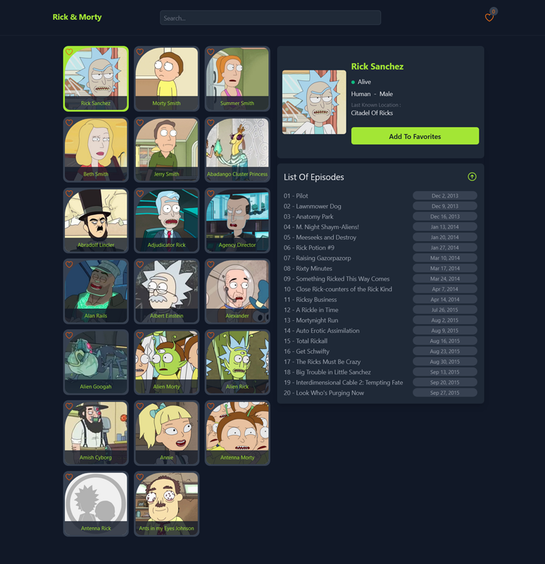

# Rick & Morty App

## Table of contents

- [Overview](#overview)
- [How to run project](#how-to-run-project)
- [Screenshot](#screenshot)
- [Built with](#built-with)
- [What I learned](#what-i-learned)

### Overview

This is a mini project to learn fetching data from [rickAndMortyAPI](https://rickandmortyapi.com/).
Fetch data and show them in a list, when click on one of them you can see the character details.
You can add the character to or delete it from localStorage.

### How to run project

- npm install
- npm run dev

### Screenshot



### Built with

- [React](https://reactjs.org/) - JS library
- [tailwind](https://tailwindcss.com/) - For styles
- [react-hot-toast](https://react-hot-toast.com/) - For error handling
- [axios](https://axios-http.com/) - For fetch data
- [heroicons](https://heroicons.com/) - For svg

### What I learned

- How to fetch data and how to use useEffect() and error handling and use loading
- How to use clean up function
- How to use localStorage in react
- how to abort one or more Web requests with AbortController()
- How to create a custom hook

```js
export default function useCharacters(url, query) {
  const [characters, setCharacters] = useState([]);
  const [isLoading, setIsLoading] = useState(false);

  // fetch data from Api for first render and when query changes
  useEffect(() => {
    const controller = new AbortController();
    const signal = controller.signal;

    // get characters
    async function fetchData() {
      try {
        setIsLoading(true);
        const { data } = await axios.get(`${url}/?name=${query}`, { signal });

        setCharacters(data.results);
      } catch (error) {
        setCharacters([]);
        toast.error(error.response.data.error);
      } finally {
        setIsLoading(false);
      }
    }

    fetchData();
    return () => {
      controller.abort();
    };
  }, [url, query]);

  return { characters, isLoading };
}
```
